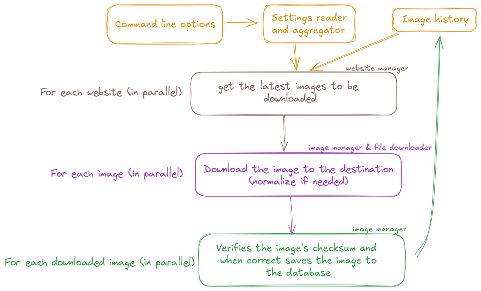

# cloud-image-download architecture document

## Introduction

### Program's goal

Downloads cloud system images (basically qcow2 files) from web sites and keeps
track of the images already downloaded and thus download only the latest ones. It is intended to be used periodically (ie: weekly)

### Target audience

This program is to be used by cloud system administrators that needs to get
cloud images and put them into their cloud system in order for them to be
available to their cloud users.

### Context

This program has been written to download the images from a machine that has
access to the internet and provide them onto a shared file system to an
another program that uploads them to the local cloud where internet is not
available. It will not upload files directly to the local cloud.

## Architectural overview

### High level diagram

### Component description

- **Checksums** (`checksums.rs`) provides a structure and functions to deal
  with different checksums (for now only SHA256 and SHA512)
- **Command line interface** (`cli.rs`) defines all options that a user can
  use from the command line.
- **Settings reader and aggregator** (`settings.rs`) Reads configuration file
  and gives a structure that aggregates all settings from command line,
  configuration file, environment variable.
- **Image history** (`image_history.rs`) manages a structure with the history
  of all files that were previously successfully downloaded. Loads and saves
  image history from an sqlite DB.
- **File downloader** (`download.rs`) downloads the images, provides a
  summary of what has been downloaded or not and verifies downloaded files. Images can be saved with a "normalized" filename. Uses crate trauma.
- **Image manager** (`cloud_image.rs`) manages cloud images that are to be found (from the websites), downloaded and verified
- **Website manager** (`website.rs`) with the settings loaded, uses
  httpdirectory crate to get the latest images to be downloaded from a
  website. Multiples latest images can be downloaded from one website (ie: `x86_64` and `aarch64` images for instance)

- **The program itself** (`cid.rs`) glues everything to enable downloading
  only latest verified images to a destination path.

## Component overview

### Modules

#### Command line interface

Options a user can provide to the program. These option will the program's behavior:

- verbosity level,
- configuration file definition (allows other than default configuration
  files),
- database path (allows to change the default place where the database
  is stored),
- limit the maximum downloads at a time,
- enabling a file verification even if the file has been skipped from
  downloading (files exists in the path but doesn't exist in the database),

The command line will not collect parameters to download images from a
specific web site.

#### Settings reader and aggregator

Reads configuration file and aggregates it with parameters from the
command line, variable environment. These settings may be:

- Web sites list
  - Name of the web site
  - Base url where to find the images
  - List of versions (of the images to download)
  - List of complementary url (one may want more than one architecture
    for instance)
  - Image name filter is a regular expression to be able to find the image
    name we need
  - Image name cleanse is a list of regular expressions that we need not
    to be in the image name (ie removes from the downlodable list all names
    that contains any of these regular expressions)
  - Destination path where a downloaded image will be saved
  - Normalize that will tell the program to save the downloaded files in a
    "normalized" way (ie with a date in it's name)

#### Image history

Keeps names of successfully downloaded images in a database:

- The database should be created if it does not exist already,
- This module provides a function to tell if an image is already
  in the database (this means same name, checksum and date).
  A function to save a downloaded image to the database.
- When a downloaded image has been successfully verified (with its
  checksum) the image name with its date and checksum is saved into
  the database.

#### File downloader

Downloads all files that are to be downloaded into it's final
destination configuration. Checksum files are downloaded into
memory, checksum is inserted into the `CloudImage` structure
and used to verify the downloaded file.

#### Checksums

Deals with different checksum types SHA256 and SHA512 for now.
Checksum computation and verification is done in the image manager
module (`verify()` method of `CloudImage`)

#### Image manager

Provides `CloudImage` structure and a method to verify the checksum
of an image and a method that will tell whether or not the file is in
the database (uses the method of image history module)

#### Website manager

Uses the settings to scrape defined websites to try to get the latest
cloud image to download among all the downloadable ones. When an url
lists directories whose names are formatted as dates (ie: YYYYMMDD)
or with numbers (ie: 41, 42, ...) the latest one is added to the
search list instead of the original one.

### Dependencies

- **`base16ct`**: Used to encode binary checksums to human readable
  base 16 strings
- **`chrono`**: Date and time manipulation library
- **`clap`**: The defacto standard for command line parsing argument
- **`clap-verbosity`**: Manages -v (--verbose) or -q (--quiet) options along
  with the log system.
- **`colored`**: To add some colors in log messages
- **`config`**: Reading configuration from files and environment variables
- **`const_format`**: Formats `CID_USER_AGENT` const string at compile time
- **`directories`**: To get user directories from XDG specifications \[1\]
- **`env_logger`**: Logger
- **`futures`**: Enable iterating in parallel over vectors
- **`httpdirectory`**: Parses HTML directories urls and returns a structured
  vector filled with directories and files
- **`log`**: Log system
- **`regex`**: Regular expression engine
- **`reqwest`**: Interface to http requests helps revrieving web pages
- **`rusqlite`**: Gives access to an sqlite database and is used to store the
  download history
- **`serde`**: Serialization / Deserialization library used to read the
  configuration file into a dedicated structure.
- **`sha2`**: Widely use library to process sha checksums and all checksums out
  there for cloud images are SHA-256 ones.
- **`shellexpand`**: expands paths filenames with `~` or variables such as
  `${USER}` or `${HOME}`.
- **`tokio`**: Used to spawn task to verify file's checksum
- **`trauma`**: Downloads files and seems more maintained than downloader crate.

## Error management

The idea here when something goes bad is to fail early as soon as possible.

## References

1. [XDG specifications](https://specifications.freedesktop.org/basedir-spec/latest/)
